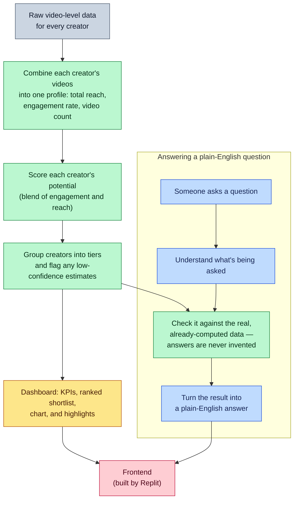

# CloutScout

A package that helps agencies identify and shortlist promising creator talent for partner engagement.

See [`docs/spec.md`](docs/spec.md) for the product spec and [`docs/model-scoring.md`](docs/model-scoring.md) for how the Potential Score is calculated.

## What's here

This repo contains a Python API that computes creator metrics from the dataset in `data/` and answers natural-language questions about them, plus a Replit frontend that consumes that API.

```
cloutscout/
  config.py       # tunable constants (score weights, model name, etc.)
  data.py         # loads the raw video dataset
  metrics.py      # creator-level aggregation + Potential Score (docs/model-scoring.md)
  schemas.py      # API response models
  api.py          # FastAPI app — the only entry point the frontend needs
  qa/
    schema.py     # the structured query the LLM is allowed to produce
    executor.py   # runs a structured query against real data (no LLM involved)
    claude.py     # NL -> query, and result -> NL narration, via Claude
frontend/         # React + Vite UI, built and maintained by Replit
docs/             # spec, data summary, scoring writeup
data/             # source dataset
tests/
```

## Architecture



Green steps are the data science: rolling raw videos up into creator profiles and a potential score. Blue steps are where Claude interprets the question and explains the answer — but the actual lookup against real data (green, in the middle) is deterministic, so Claude never invents a number. Pink is the frontend, architected separately by Replit and consuming this API.

## Running locally

Requires [`uv`](https://docs.astral.sh/uv/).

```sh
uv sync
cp .env.example .env   # then fill in ANTHROPIC_API_KEY — required for /api/qa
uv run uvicorn cloutscout.api:app --reload
```

The API is now at `http://127.0.0.1:8000`:

- `GET /api/health` — liveness check
- `GET /api/dashboard` — the at-a-glance summary (KPIs, ranked shortlist, quadrant chart data, callouts)
- `POST /api/qa` `{"question": "..."}` — plain-English Q&A over the same data

`/api/dashboard` works with no API key. `/api/qa` needs `ANTHROPIC_API_KEY` set, since it calls Claude to translate the question into a query and narrate the result (see `docs/spec.md` section 5 for how that's kept grounded in real data).

## Inspecting the API locally

With the server running, FastAPI provides an interactive explorer with no extra setup:

- `http://127.0.0.1:8000/docs` — Swagger UI: try each endpoint from the browser, see request/response schemas
- `http://127.0.0.1:8000/redoc` — ReDoc: read-only, cleaner for skimming the schema

Or hit it directly:

```sh
curl http://127.0.0.1:8000/api/health
curl http://127.0.0.1:8000/api/dashboard
curl -X POST http://127.0.0.1:8000/api/qa \
  -H "content-type: application/json" \
  -d '{"question": "which creators get the most engagement?"}'
```

## Handing off the frontend

The frontend in `frontend/` is built and architected by Replit; the backend here stays intentionally decoupled from it:

- CORS is wide open (`cloutscout/api.py`) so the Replit-hosted frontend, running on a different origin, can call the API directly during development.
- No Dockerfile, Procfile, or hosting config is included on the backend side; that's owned by Replit's deployment setup.
- The API is the contract: the frontend consumes `/api/dashboard` and `/api/qa`, and everything it needs is documented in `docs/spec.md` sections 4 and 5.
